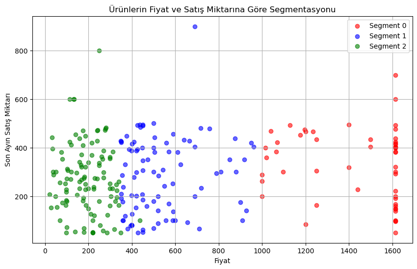

# Kozmetik Ürünleri İçin Web Madenciliği Tabanlı Karar Destek Sistemi

Bu proje, e-ticaret platformlarından toplanan kozmetik ürün profilleri üzerinde veri madenciliği, denetimsiz makine öğrenmesi ve fiyat esnekliği analizleri uygulayarak, yöneticiler ve pazarlama stratejistleri için veri odaklı bir **Karar Destek Sistemi (KDS)** sunmaktadır.

---

## 1. Projenin Amacı ve Kapsamı
Projenin temel amacı, kozmetik ürün pazarındaki karmaşık fiyat, reyting, indirim ve satış ilişkilerini analiz ederek;
* Ürünleri yapısal benzerliklerine göre segmentlere ayırmak,
* Hangi ürün segmentinin fiyat değişimlerine nasıl tepki verdiğini (Fiyat Esnekliği) ölçmek,
* Şirket kârlılığını maksimize edecek dinamik fiyatlandırma ve kampanya stratejileri geliştirmektir.

---

## 2. Metodoloji ve Proje Aşamaları

###Aşama_1: Veri Toplama (Web Madenciliği)
Projede kozmetik kategorisine ait ürün verileri dinamik ve statik web kazıma (Web Scraping) yöntemleri kullanılarak toplanmıştır. Toplanan ham veri setinde aşağıdaki öznitelikler (features) yer almaktadır:
* `brand_extracted` (Ürün Markası)
* `category` (Ürün Kategorisi: Parfüm, Cilt Bakımı, Makyaj, Aksesuar vb.)
* `old_price` (Ürünün Çizgili/Eski Fiyatı)
* `price` (Ürünün Güncel Satış Fiyatı)
* `rating` (Kullanıcı Ortalama Puanı)
* `sales_last_month` (Son Ayın Satış Miktarı / Yorum Yoğunluğu Tabanlı Talep)

### Aşama_2: Veri Ön İşleme (Data Preprocessing)
Toplanan ham veriler analiz ve modelleme süreçlerine uygun hale getirilmek için şu aşamalardan geçirilmiştir:
1. **Eksik Değer Kontrolü:** Eksik veri barındıran satırlar tespit edilerek `dropna()` yöntemiyle temizlenmiştir.
2. **Tekrar Eden Kayıtlar:** Mükerrer ürün girişleri `drop_duplicates()` fonksiyonu ile ayıklanmıştır.
3. **Tip Dönüşümleri:** Metinsel formda gelen fiyat verileri, gereksiz karakterlerden (`TL`, ` `, `,`) arındırılarak sayısal (`float`) forma dönüştürülmüştür.
4. **Tutarsız Veri Kontrolü:** Mantıksal sınırların dışındaki (negatif fiyat veya 5'ten büyük reyting) hatalı kayıtlar filtrelenmiştir.

### Aşama_3: Özellik Çıkarımı (Feature Engineering)
Ham verilerden işletme kararlarına doğrudan etki edecek yeni anlamlı değişkenler türetilmiştir:
* **İndirim / Zam Oranı (`discount_rate`):** Ürünlerin eski fiyatı ile yeni fiyatı arasındaki değişim oranı formüle edilmiştir:
  $$\text{Discount Rate} = \frac{\text{old\_price} - \text{price}}{\text{old\_price}}$$
  *(Negatif değerler, ürünün güncel fiyatının eski fiyatından yüksek olduğunu (fiyat artışı) göstermektedir.)*
* **Logaritmik Dönüşümler:** Talep ve Fiyat esneklik analizi için doğrusal OLS regresyonuna uygun `log_price` ve `log_sales` değişkenleri üretilmiştir.

### Aşama_4: Yapay Zekâ Modelleme ve Kümeleme
Veri setinde hem kategorik hem de sayısal değişkenler bir arada bulunduğu için karma veri yapısını destekleyen **K-Prototypes** algoritması kullanılmıştır. Ürünler yapısal olarak 3 ana segmente ayrılmıştır:

1. **Segment 2 (Yeşil): Ekonomik / Sürüm Ürünleri** (0 - 350 TL)
2. **Segment 1 (Mavi): Orta / Standart Ürünler** (350 - 1000 TL)
3. **Segment 0 (Kırmızı): Premium / Lüks Ürünler** (1000 TL ve Üzeri)

#### Ürün Segmentasyon Grafiği
*(K-Prototypes modelinin fiyat ve satış eksenindeki kümelenmesi)*

---

## 3. Model Sonuçları ve Sayısal Analizler

Segmentasyonun ardından, En Küçük Kareler Regresyonu (OLS) kullanılarak **Kırmızı (Premium)** ve **Yeşil (Ekonomik)** segmentlerin fiyat esneklikleri ölçülmüştür.

### Kırmızı- Premium Segment Regresyon Çıktıları (N=52)
* **R-squared (%14.6):** İndirim, fiyat ve reyting öznitelikleri satış değişiminin %14.6'sını açıklamaktadır.

| Değişken | Katsayı (Coef) | P-Value | Yorum |
| :--- | :--- | :--- | :--- |
| **log_price** | -0.0084 | 0.986 | Fiyata tamamen duyarsız. Fiyat değişimi satışı etkilemiyor. |
| **discount_rate** | +0.0836 | **0.016** | **İstatistiksel olarak anlamlı.** Müşteri fiyata değil indirim algısına bakıyor. |

* **Kategori Kırılımı (Zam Durumu):** Parfüm kategorisinde %297, Cilt Bakımında %82.6 oranında fiyat artışı (zam) yapılmasına rağmen, Parfüm aylık ortalama 356.5 adet ile segmentin en çok satan kategorisi olmuştur.

### Yeşil- Ekonomik Segment Regresyon Çıktıları (N=108)
Ekonomik segmentte fiyat katsayısının mutlak değeri premium segmente göre daha yüksektir. Bu durum ekonomik segmentte fiyat değişimlerine daha yüksek duyarlılık olabileceğine işaret etmektedir.
* **discount_rate Katsayısı (+0.2908):** Tüketicinin indirim duyarlılığı premium segmentin **3.5 katıdır**.

---

## 4. Yönetici Karar Destek Önerileri

Analiz sonuçlarına dayanarak şirket yönetiminin alması gereken stratejik aksiyonlar şunlardır:

1. **Agresif Fiyatlandırma (Kâr Maksimizasyonu):** **Parfüm ve Cilt Bakımı (Premium)** kategorisinde fiyat artışlarından kaçınılmamalıdır. Müşteri lüks algısı ve marka sadakati nedeniyle fiyat artışlarına reaksiyon göstermemektedir.
2. **Psikolojik Fiyatlandırma İllüzyonu:** İndirim etiketlerinin premium tüketiciler üzerinde olumlu etkiler oluşturduğu gözlemlenmiştir. Kampanya stratejileri geliştirilirken bu bulgu dikkate alınabilir.
3. **Stok Eritme ve Sürüm Kampanyaları:** **Yeşil Segment (Ekonomik)** ürünlerinde asla fiyat artışı yapılmamalıdır. Tüketicilerin indirim hassasiyeti bu grupta çok yüksek olduğundan, stokları eritmek veya siteye trafik çekmek için **Cilt Bakımı ve Makyaj (Ekonomik)** kategorilerinde net %20 indirim kampanyaları uygulanmalıdır.
